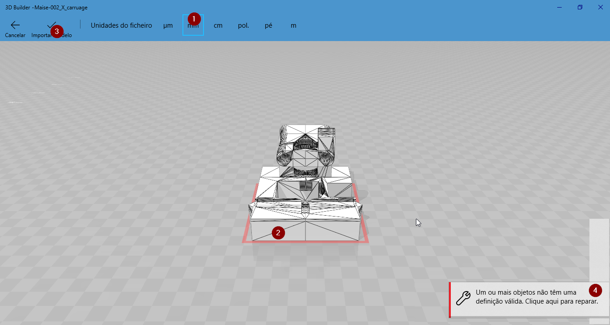

# maZEmendel

  

I have made this because I can, and i love history! and is a historic printer!

My motivation is to make a printer with a printer, i have a [*Beethefirst+*](https://beeverycreative.com/beethefirstplus/), that is **portable** and **user friendly** and I wanted to prove that with a Little machine, I could create a bigger one! and more maker oriented.
That is the base of REPRAP movement!

You will have all the gcode already generated to print one just like mine in you beethefirst! and if you do, **Show me!**

## First technical notes about this printer

This printer is not easy to assemble, It has a lot of bolts and hardware, but if well assembled, it can be reliable.
You have a calibration paragraph, as a guide for you to calibrate the perpendicularity of the X,Y and Z axis.
I have printed the majority of the parts in PETG because my BTF+ (beeverycreatrive printer) prints it very well, it is more flexible than PLA, thus absorbs some vibrations and has better layer adhesion.

**Side note** if you use PETG, try to use one that is transparent, the opaque ones normally has worse strength proprieties.

## Modeling
I have used **BLENDER**, because I'am a blender hardcore-user, because I can, and because it's really good to edit meshes.

To cut pieces, I have used Rhino, because it's the only paid CAD program i have, but you can use the dxf files, or send me a mail for me to convert the files to your format. To bee fair the only part you have to cut with precision is the Y wood base, later on, i will post the fabrication manual.

The file as called *"maise.blend"*, with that file i have rendered all images for the manual, and modeled all parts that I need to create or change for this build. If you need to edit it, you can and you should! That is the purpose of sharing the code. All the parts have the same name of the BOM file, and are distributed by layers, I know that it could be better organized, but better done than perfect.
You should use some add-on's like "3d print toolbox", "Layer management", "cycle engine", when you use models from blender you can try to clean all the mesh to be printable, but that is normally for power users, and when you use Boolean tools is impossible to make that without losing the modifiers stack, and we have to source the more editable parts we can, for others to be able to change. The pipe-line I use is export meshes to stl with "3d print toolbox" add on, then I use a tool that came with windows10 called "3d Builder" that is great to correct the meshes.

### Correcting meshes on 3d Builder

- 1 Import as mm;
- 2 A red rectangle in the base of the model, means that the model has errors;
- 3 Import the model;
- 4 When you import the model, a rectangle shows up in the right down of your screen, click on it to repair;
- 5 Save your file em STL;

## Changes

- New X axes;
- remodeled Y;
- Some updates on Z;
- Bowden for extruder;
- E3d v6 hotend;
- Igus sliders for X and Y;
- board MKSgen 1.4;
- Drivers X, Y, E, Trynamic 2100, Z LV8729;
- Added LEDs to the system, you can add RGB "if you do show it!"

Working..

## BOM Build of Materials

[Spreedsheet](https://docs.google.com/spreadsheets/d/16tOSJMvPqgqwrDMo-RX5avmmjWwADpJSkYPEsrkDC4U/edit?usp=sharing)
(only parts to be printed the parts to buy needs to be updated)

## Assembly the frame
### Structure

1. Pick 6X380 M8 rods, and 2X *"001 bar-clamp-tall"*, and M8 Bolts and Washers, and displace them like in the picture.
2. Pick parts: **4X** *"001 Frame vertex with foot"*; **2X** *"001 frame-vertex"*, and assemble 2 strutures like on the image, tighten the nuts by hand. 
3. Pick 6X M8x40 Bolts and assemble like picture, to make shore that the frame will be the most simetric possible, like picture 4. then you can tighten a Little bit before brake, all the nuts.
4. The continuing of picture 3.
5. Pick the M8 Rods like is in the picture, and pick the **6X** *"001 bar-clamp"*, and assemble properly.
6. Assemble the main structure, by hand;

## Extruder

### Saintflint

  

This is the best bowden printed extruder I have used! It was developed by a great friend [Michael Memeteau](https://incompreendido/in/mmemetea/), creative and resourceful engineer.
This extruder has a concept that double the area of contact between the motor gear and the filament.
I have edited the model to fit a MK10 type of gear if you have diferent requirements, feel free to edit, you have an editable file [onshape instance](https://cad.onshape.com/documents/5c209690b10748338481382a/w/6d6638f54420d7c76fe7949d/e/2d47f4694787414fab59244e)

In the [source](https://www.thingiverse.com/thing:979113) you have all information you need to assemble the extruder!

**Recommendation** - print all the parts in PETg and 90% infill, it takes longer, uses more plastic but it makes sure you din't end up with a broken extruder.

### Hotend
I have used a Bowden setup with E3d v6 Chinese clone, before all the test I am thinking about upgrading it to an original one!

### Wiring

#### MKS GEN 1.4
I have chosen this because it has a good value for the money, in the BOM you have links to buy the board, Since I want a silent machine I decided to use the TMC2100 stepper drivers for the X, Y and E axis. They are not cheep but they are worth it!
You should be able to assemble the controller with these [instructions](http://reprap.org/wiki/MKS_GEN) from reprap community, if you use LEDs you should connect to the 12V output, the same place you connect the hotend fan.

### ATX Power supply 
To use a PC ATX power supply, you have to convert it, go to this [instructables](http://www.instructables.com/id/A-Makers-Guide-to-ATX-Power-Supplies/) you only need the 12V track, unless you config a raspberrypi with octaprint, if you do, use the 5x track to power the raspberrypi.

### Filament Sensor

To implement!
